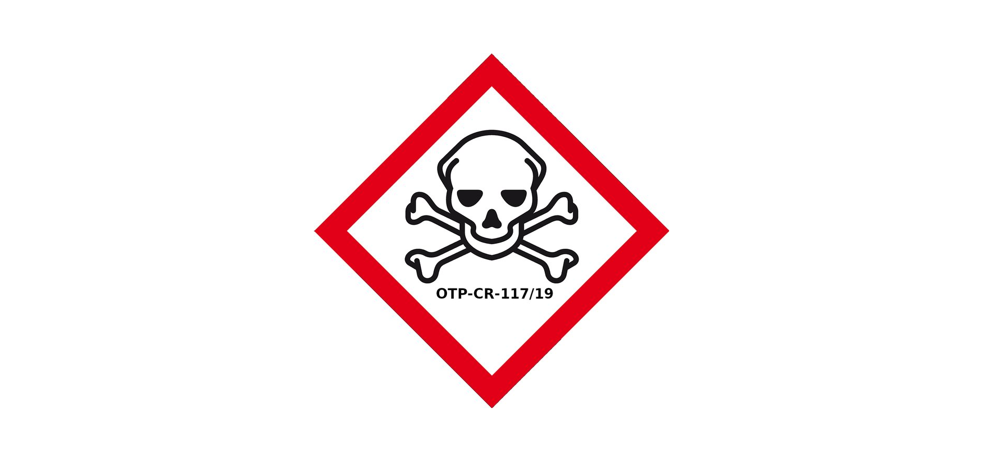

.. _about:

.. raw:: html

     

.. title:: About

In 2018 i :ref:`informed <guilty>` the king of the netherlands that what he calls medicine in his "care" laws are not medicine but poison.
:ref:`Proof <evidence>` of these medicine being poison were shown to the king, who's (personal) kabinet wrote back that
:ref:`"the king took note of what i have written" <king>`.

Using poison makes the care laws used in the netherlands to provide care to elderly and handicapped, criminals and psychiatric patients not care laws but genocide laws with which the king is killing groups of the population by giving them poison instead of medicine in the "care" they are forced to undergo.

I :ref:`wrote <writings>` the prosecutor asking for an arrest of the king (make him stop), the prosecutor decided to call it a "no basis to proceed". It requires a `basis to prosecute <reconsider.html>`_ of the prosecutor to get the king in his cell and his genocide, thereby, stopped.
